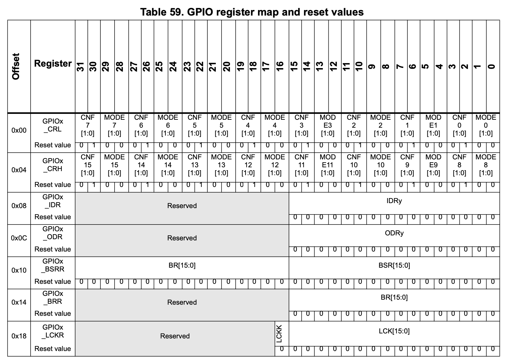

# NUCLEO-F103RB FREERTOS BLINK LED

This project implements a task on FreeRTOS to blink a LED on a NUCLEO-F103RB board.

- [How it Works](#how-it-works)
  - [Task Creation](#task-creation)
  - [LED Blinking Logic](#led-blinking-logic)
  - [Scheduler Initialization](#scheduler-initialization)
  - [Infinite Loop](#infinite-loop)
  - [Conclusion](#conclusion)
- [Requirements](#requirements)
- [Usage](#usage)
  - [Run Simulation](#run-simulation)
  - [Compile](#compile)
  - [Debug](#debug)
    - [Command Line](#command-line)
    - [Visual Studio Code](#visual-studio-code)
  - [Clean](#clean)

A **NUCLEO-F103RB** board simulated on QEMU is used.

## How it Works

### Task Handler Function

The `vTaskBlinkLED_handler` function, executed by the created task, contains a continuous loop that toggles the state of the LED pin using `HAL_GPIO_TogglePin` every 1000 milliseconds (1 second) with `vTaskDelay(1000)`.

```c
void vTaskBlinkLED_handler(void *params)
{
  while(1) {
    HAL_GPIO_TogglePin(GPIOA, LD2_Pin);
    vTaskDelay(1000);
  }
}
```

### HAL_GPIO_TogglePin 

The `HAL_GPIO_TogglePin` function is used to toggle the state of the LED pin. It takes two arguments, the GPIO port and the pin number.

`GPIOA` is a macro that represents the GPIO port A (`0x40010800`) and `LD2_Pin` is a macro that represents the `GPIO_PIN_5` (`0x20`).

The **NUCLEO-F103RB** GPIO port memory mapping is the following

<!-- inisert the image of the memory mapping -->
<p align="center">
  
</p>

The state of a pin can be changed by programming the BSRR (Bits Set Reset Register). The Low Bits of the BSRR are used to `set` the state of the pins, while the High Bits are used to `reset`.

The `HAL_GPIO_TogglePin does exatly this operation

```c
/* get current Output Data Register value */
odr = GPIOx->ODR;

/* Set selected pins that were at low level, and reset ones that were high */
GPIOx->BSRR = ((odr & GPIO_Pin) << GPIO_NUMBER) | (~odr & GPIO_Pin);
```

## Requirements

To run the project you need the following requirements:

- **xPack QEMU**
- **Arm GNU Toolchian**

_refer to the tutorial section to the guide on how to install those packages._

## Usage

### Run Simulation

To compile the project run this command in the **NUCLEO_F103RB_FREERTOS_BLINK_LED** directory

```bash
make qemu
```

### Compile

If you just want to compile the project run

```bash
make
```

### Debug

#### Command Line

To debug the project from command line run this commands

```bash
make qemu-gdb
```

and in another terminal session

```bash
arm-none-eabi-gdb build/NUCLEO_F103RB_FREERTOS_BLINK_LED.elf -ex "target remote localhost:1234"
```

#### Visual Studio Code

To have a nice interface to debug the project you can use the extension for C/C++ for VS Code.

You might need to change the `.vscode/launch.json` and `.vscode/tasks.json` according to your system.

### Clean

To clean all the build files run

```bash
make clean
```